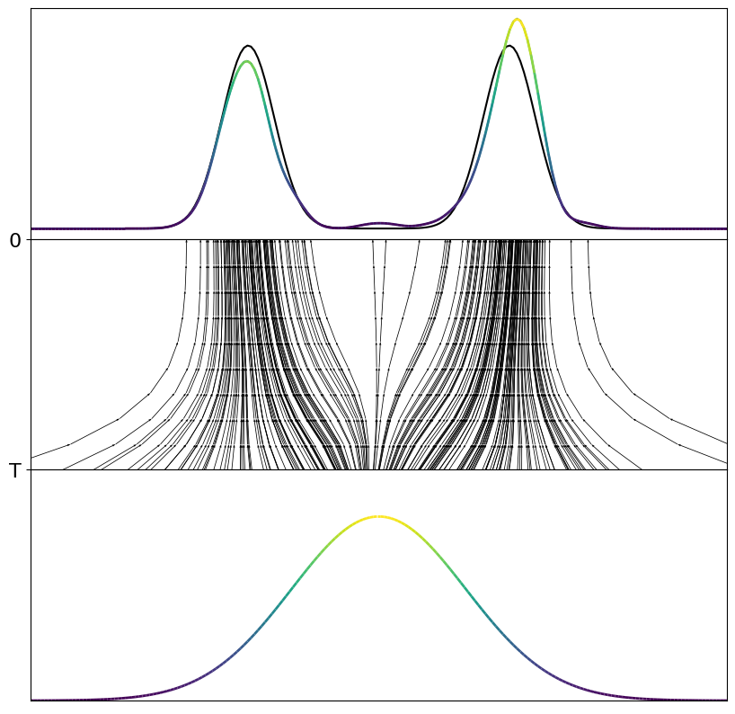
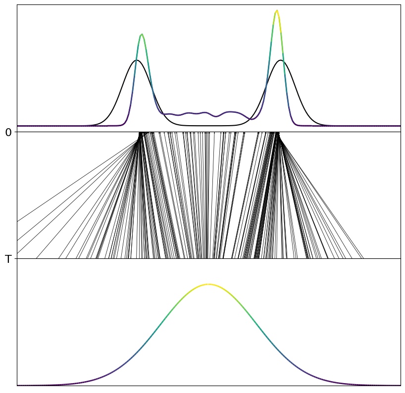

# cmt_toy_task


Minimal unofficial implementation of Consistency Trajectory models proposed in [paper_link](https://openreview.net/attachment?id=ymjI8feDTD&name=pdf).

---

### Installation

```bash
pip install -e .
```

---

### Consistency Trajectory Models

A new class of generative models close of Diffusion models, that learn to model the trajectory of Probability Flow ODEs directly. Diffusion models learn to predict the denoised action $x_0$ from the noisy action $x_T$ by the current score of the PF ODEs. Consistency Trajectory models learn to predict the trajectory of the ODEs directly and can jump to any point of the trajectory. They can be seen as a generalization of consistency models from Song et al. (2024) and can be trained with the an extended loss function combining score matching objective from diffusion models with a _soft_ consistency loss.


#### Boundary Conditions

$$
G_{\theta}(x_t, t, s):= \frac{s}{t} x_t + ( 1 - \frac{s}{t})g_{\theta}(x_t, t, s)
$$
with the standard Karras et al. (2022) preconditioning functions inside $g_{\theta}(x_t, t, s)$.
The CTM models introduce a novel parameter $s$ that defines the target time step of the ODEs. 


#### Training Objective

The original paper proposes the following training objective consisting of a score matching objective and a consistency loss combined with an additional GAN loss. 
However, since we do not wanna use GAIL style training (yet) we only use the score matching objective and the consistency loss.

$$
\mathcal{L} = \lambda_{\text{Score}} \mathcal{L}_{score} +\lambda_{\text{CTM}}  \mathcal{L}_{consistency} + \lambda_{\text{GAN}} \mathcal{L}_{GAN}
$$

The score matching objective is defined as follows:

$$
\mathcal{L}_{score} = \mathbb{E}_{x_0 \sim p_0} \left[ \left\| \nabla_{x_0} \log p_{\theta}(x_0) - f_{\theta}(x_0, t=0) \right\|^2 \right]
$$

The consistency loss is defined as follows:

$$
\mathcal{L}_{consistency} = \mathbb{E}_{x_0 \sim p_0} \left[ \mathbb{E}_{t \sim \text{Unif}(0, T)} \left[ \left\| x_0 - \phi_{\theta}(x_0, t) \right\|^2 \right] \right]
$$


---


### Toy Task Results 

Here are some first results of CMT trained from scratch without a teacher model.


<div style="display:flex">
  
  
</div>
<p style="text-align:center">From left to right: CMT with 10 Euler Steps, Multistep and Single Step prediction with CMT.</p>


Right now the model performs significantly better with 10 steps. Working on improving the single step prediction. Lets see whats possible. 


--- 


### Lessons learned


None so far :D 


---

### To Dos

 - [ ] Implement the new sampling method
 - [ ] Add new toy tasks
 - [ ] Compare teacher and student models vs from scratch training
 - [ ] Find good hyperaparmeters
 - [ ] Work on better single step inference
 - [ ] Add more documentation


---

### Acknowledgement


- the model is based on the paper [Consistency Trajectory Models](https://openreview.net/attachment?id=ymjI8feDTD&name=pdf)
